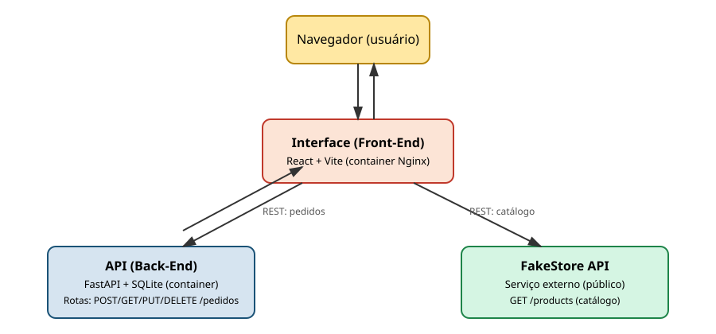

# FakeStore MVP - Front‑End

Interface web feita em **React + Vite** para o MVP de componentização (Cenário 1). O front‑end busca produtos na **FakeStore API** e se conecta ao **back‑end próprio** para salvar e gerenciar os pedidos.
---

---



### Fluxo de Dados

- **Produtos:** Busca e filtragem feitas diretamente via API externa (FakeStore), sem redirecionamento.
- **Pedidos:** Comunicação via REST com o back-end próprio, cobrindo as quatro operações básicas: `POST` (criação), `GET` (listagem/busca), `PUT` (alteração de status) e `DELETE` (cancelamento).

---

## Integracão com API Externa

- **Fonte:** [FakeStore API](https://fakestoreapi.com/)
- **Autenticação:** Pública (não exige API Key)
- **Endpoints consumidos:**
  - `GET /products` — Lista geral de produtos
  - `GET /products/category/{categoria}` — Produtos por categoria
  - `GET /products/categories` — Lista de categorias

---

## Funcionalidades

- Navegação no catálogo com filtro por categoria
- Carrinho de compras com edição de quantidades
- Checkout / Criação do pedido (`POST /pedidos`)
- Painel de pedidos com paginação e filtro por status (`GET /pedidos`)
- Atualização de status (`PUT /pedidos/{id}`) — _Pendente → Pago → Enviado → Cancelado_
- Exclusão ou cancelamento de pedidos (`DELETE /pedidos/{id}`)

---

## Como Executar

### 1. Localmente (Node.js)

**Pré-requisitos:** Node.js (v18+)

```bash
# Instale as dependências
npm install

# Configure a URL do back-end
cp .env.example .env

# Inicie o servidor de desenvolvimento
npm run dev

```

Acesse em `http://localhost:5173`.

_Nota: Certifique-se de que o back-end (`FakeStore-backend`) esteja rodando em `http://localhost:8000` ou ajuste o valor no arquivo `.env`._

---

### 2. Via Docker

```bash
docker build -t fakestore-frontend --build-arg VITE_API_URL=http://localhost:8000 .
docker run -p 5173:80 fakestore-frontend

```

> **Atenção:** A URL do back-end (`VITE_API_URL`) deve ser um endereço acessível pelo navegador do usuário (ex: `http://localhost:8000`), pois as requisições HTTP são disparadas no lado do cliente (client-side), e não de dentro do container Docker.

---

## Estrutura de Pastas

```text
FakeStore-frontend/
├── src/
│   ├── api/
│   │   ├── backend.js     # Cliente REST para o back-end próprio
│   │   └── fakestore.js   # Cliente REST para a FakeStore API
│   ├── components/
│   │   ├── ProductList.jsx
│   │   ├── Cart.jsx
│   │   └── Orders.jsx
│   ├── App.jsx
│   └── main.jsx
├── docs/
│   └── arquitetura.svg
├── Dockerfile
├── nginx.conf
├── package.json
└── README.md
```
